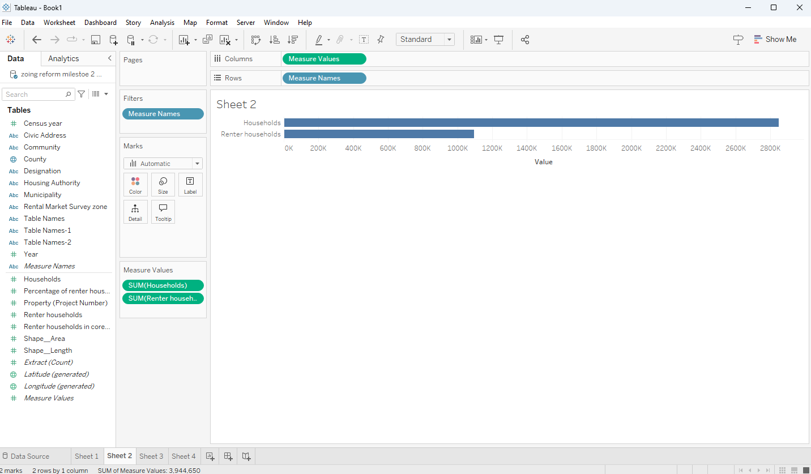

# HRM-Housing-project
Housing Affordability and Fiscal Sustainability in Halifax 

## Decision Statement 

Should the Nova Scotia prioritze zoning reform to enable higher-density housing in established neighbourhoodsor continue expanding housingsupply through suburban greenfield development, in order to improve affordability while maintaining municipal fiscal sustainabilityy over the next decade. 

> [!WARNING]
> There are others doing this already in the class. There is a requirement to be unique to you.  Consider pivoting to your hometown.

## Executive Summary 

Housing affordability in the Halifax Regonal Municipality has become increasingly strained as population growth, low vacancy rates, and rising housing costs placepressure on renters and prospective homebuyers. at the same time, the municipality faces long term fiscal challenges related to infrastructure expansion and service delivery, making decisions about housing development patterns especially consequential. how and where new housing is built therefor has significant implications for both affordability outcomes and municipal financial sustainability.

This project evaluates the tradeoffs between enabling higher density housig through zoning reform in established neighbourhoods and continuing to expand housing supply through suburban greenfield development. using housing and demographic data alongside systems thinking tools, the analysis examines how these strategies influence housing supply, prices, infrastructure costs, and fiscal pressure overtime. The goal is to provide evidence based guidence to support municipal decision makers in balancing housing affordably with long term fiscal sustainability over the next decade. 

[Read more](Background.md)

## Initial CLD

## CLD brief description 

The casual loop diagram highlights key feedback mechanisms affecting housing affordability and municipal finances in HRM. Reinforcing loop R1 shows how suburban expansion increases infrastructure costs and fiscal pressure, encouraging continued outward development. Loop R2 illustartes how economic opportunity and percieved desirability attract in migration, increasing housing demand and price pressures. Finally Loop B1 demonstartes how increased zoning permissiveness supports higher density infill development, exopandinng housing supply and eating affordability pressures overtime. 

## Milestone 2 

## Milestone 2: Data Sources summary

Four datasets were used to inform the analysis of housing affordability and supply dynamics across Nova Scotia. The first examined the percentage of renters by community, highlighting variation in rental demand and identifying areas where affordability pressures may be strongest. The second analyzed active residential housing projects by community, showing how development activity is distributed across the province and where supply expansion is most concentrated. The third dataset tracked core housing need over time, providing insight into broader trends in housing adequacy and affordability challenges. The fourth examined rent price trends over time, demonstrating sustained upward pressure on rental costs across Nova Scotia. Together, these data sources helped identify key system variables—such as renter concentration, housing supply growth, development distribution, rent escalation, and affordability pressures—and directly informed the refinement of the Causal Loop Diagram.

## Data Sources 

https://data-hrm.hub.arcgis.com/datasets/HRM::zoning-boundaries/explore?location=44.853757%2C-63.171443%2C8

 https://data-hrm.hub.arcgis.com/datasets/18bd9d8f90c84f2caf80260c0ef91c82_0/explore?location=44.854030%2C-63.171178%2C8
 
 https://lemr.ca/data-maps/halifax/

## Data Wrangling 

 

## Visualization 1 

This visualization shows the percentage of rented households in core housing needs. It shows the change over recent years which is lowest at the end of 2022. This matters for the Zoning reform in Nova Scotia as it is expensive to make down payments on houses so with the reform In place it will likely lower cost of living and make it slightly more affordable if multiple units are created into duplexes and stuff rather than massive houses taking up a lot of space.

## Visualization 2 

This visualization shows relationships between variables of regular households compared to renter households. There are 2 849 975 regular households compared to 1 094 675 renter households. When implementing a working with the reform over the next decade it this will allow cheaper and more affordable rent so people who can’t afford there ow house to be able to live comfortably while paying rent and all other necessities. 

## Visualization 3 

This visualization shows the percentage of renters in different parts of nova scotia. This refers to my CLD diagram when breaking down affordability. So, you see that Dartmouth has high renting percentage compared to Bedford as it is more of an affordable place to rent with apartments and duplexes, which are going to be the cheaper option then renting a whole house as Bedford has a more limited option then the higher percentage places.

## Visualization 4 

This visualization shows the number of property projects in nova scotia all over. With Halifax having a large amount of the population it is good that they have so many projects on the go. It is important for the zoning reform to have the projects starting now to allow for cheaper living to start developing now. Smaller places like Falmouth would see less projects on the go as population is small and all around more affordable living so its important Halifax is generating a lot of it for people who live in the city. 

## Refined CLD Diagram 

 

## Explanation of key feedback loops and impications for the decision 

## Balancing loop 

The balancing loop captures the system’s natural constraints. As housing supply increases, available land for development decreases, especially in high-demand areas like Halifax. Reduced land availability can raise development costs and, in turn, rent prices, which lowers renter affordability. As affordability worsens, pressure may grow to slow development or maintain current regulations, limiting further supply expansion and stabilizing the system rather than allowing continued growth.

## Reinforcing loop 

The reinforcing loop in this system shows how zoning reform can generate self-sustaining improvements in affordability. When zoning reform allows the creation of more duplexes and apartments, housing supply increases. As supply expands, renter affordability improves, which can build political and public support for continued reform. That additional support enables further zoning changes, creating a cycle that strengthens itself over time.

## Implications for the decisions 

The implication of these feedback loops for the decision is that zoning reform has the potential to improve housing affordability, but its impact will depend on how the system’s constraints are managed. The reinforcing loop suggests that reform can generate compounding benefits over time by increasing housing supply and strengthening support for continued density and development. However, the balancing loop shows that land limitations and rising development costs may eventually slow or offset those gains, particularly in high-demand areas like Halifax. This means that zoning reform alone may not be sufficient; to sustain affordability improvements, it likely needs to be paired with policies that address land availability, infrastructure capacity, and cost pressures.

## System Implications 

Overall, the system behaves in a way that produces both growth and constraint at the same time. Zoning reform can trigger reinforcing dynamics that improve housing supply and affordability, but structural limits such as land scarcity and rising costs naturally push the system back toward equilibrium. This means affordability challenges are not caused by a single factor, but by interconnected feedback processes. Long-term improvement will depend on managing these feedback loops strategically rather than expecting one policy change to permanently solve the problem.

## Milestone 3: Path A System Focus

## System Archyetype Identification 

The system underlying housing affordability in Nova Scotia most closely reflects Growth and Underinvestment. In this system, rising housing demand places increasing pressure on the province’s housing suppl and rental market, also affordability. While zoning reform and higher-density development could help relieve this pressure, investment in supportive policies, infrastructure, and regulatory change is often delayed or insufficient relative to the pace of demand growth.

