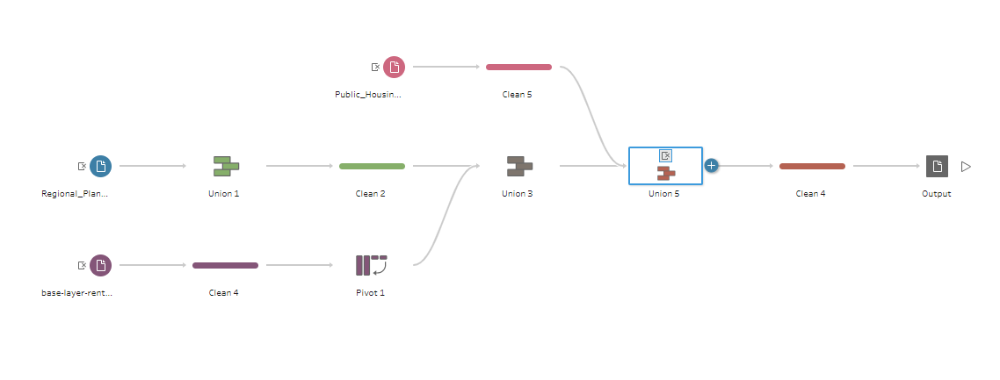
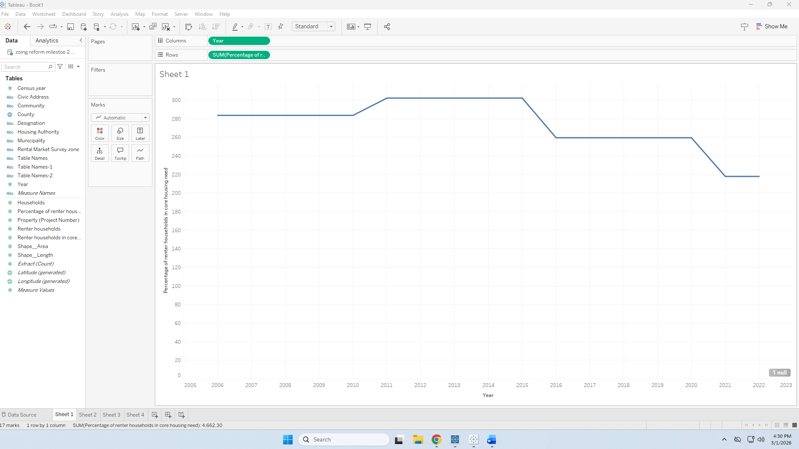
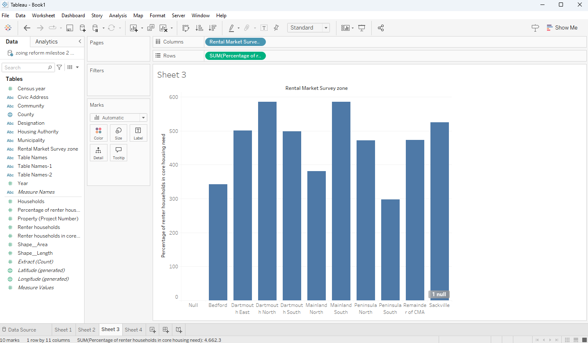
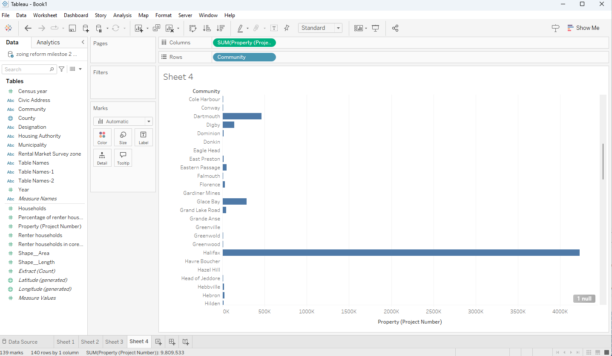
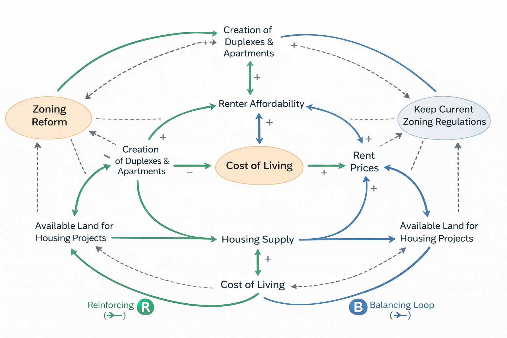

# HRM-Housing-project
Housing Affordability and Fiscal Sustainability in Halifax Regional Municipality

## Decision Statement 

Should HRM prioritize zoning reform to enable higher-density housing in established neighbourhoods, or continue expanding housing supply through suburban greenfield development, in order to improve affordability while maintaining municipal fiscal sustainability over the next decade?

## Executive Summary 

Housing affordability in the Halifax Regional Municipality has become increasingly strained as population growth, low vacancy rates, and rising housing costs place pressure on renters and prospective homebuyers. At the same time, the municipality faces long-term fiscal challenges related to infrastructure expansion and service delivery, making decisions about housing development patterns especially consequential. How and where new housing is built therefore has significant implications for both affordability outcomes and municipal financial sustainability.

This project evaluates the trade-offs between enabling higher-density housing through zoning reform in established neighbourhoods and continuing to expand housing supply through suburban greenfield development. Using housing and demographic data alongside systems thinking tools, the analysis examines how these strategies influence housing supply, prices, infrastructure costs, and fiscal pressure over time. The goal is to provide evidence-based guidance to support municipal decision-makers in balancing housing affordability with long-term fiscal sustainability over the next decade.

## Live Dashboard
[View the Streamlit Dashboard here](https://hrm-housing-project-ipzb4fxhbv3d8jhgv9sgdb.streamlit.app/) 

## Table of Contents
- [Data Sources](#data-sources)
- [Data Wrangling](#data-wrangling)
- [Exploratory Findings](#exploratory-findings)
- [Refined CLD Diagram](#refined-cld-diagram)
- [Explanation of Key Feedback Loops and Implications for the Decision](#explanation-of-key-feedback-loops-and-implications-for-the-decision)
- [Analysis](#analysis)
- [Scenario Narratives](#scenario-narratives)
- [Leverage Point Analysis](#leverage-point-analysis)
- [Implications for This Decision](#implications-for-this-decision)
- [Recommendations](#recommendations)
- [Limitations and Future Work](#limitations-and-future-work)
- [References](#references)
 
## Data Sources 

Four datasets were used to inform the analysis of housing affordability and supply dynamics in HRM. The first examined the percentage of renters by community, highlighting variation in rental demand and identifying areas where affordability pressures may be strongest. The second analyzed active residential housing projects by community, showing how development activity is distributed across HRM and where supply expansion is most concentrated. The third tracked core housing need over time, providing insight into broader trends in housing adequacy and affordability challenges. Together, these data sources helped identify key system variables such as renter concentration, housing supply growth, development distribution, rent escalation, and affordability pressures, and directly informed the refinement of the Causal Loop Diagram.

### Source Links

https://data-hrm.hub.arcgis.com/datasets/HRM::zoning-boundaries/explore?location=44.853757%2C-63.171443%2C8

 https://data-hrm.hub.arcgis.com/datasets/18bd9d8f90c84f2caf80260c0ef91c82_0/explore?location=44.854030%2C-63.171178%2C8
 
 https://lemr.ca/data-maps/halifax/

## Data Wrangling Process

 

## Exploratory Findings

## Renter Households Over Time 

 

This visualization shows the percentage of renter households in core housing need over time. It helps show whether affordability pressures in HRM are improving or worsening, which matters when evaluating whether zoning reform could support more affordable housing options.

## Households vs Renter Households

 

This visualization shows how renter concentration differs across rental market survey zones in HRM. Higher renter concentration can signal where affordability pressures may be strongest and where policy attention may be most needed.

## Renter Households by Zone

 

This visualization shows the percentage of renters in different parts of nova scotia. This refers to my CLD diagram when breaking down affordability. So, you see that Dartmouth has high renting percentage compared to Bedford as it is more of an affordable place to rent with apartments and duplexes, which are going to be the cheaper option then renting a whole house as Bedford has a more limited option then the higher percentage places.

## Projects by Community

 

This visualization shows the distribution of active residential housing projects across communities in HRM. It helps identify where new supply is concentrated and whether development activity is occurring in the areas facing the greatest housing pressure.

## Refined CLD Diagram 

 

## Explanation of key feedback loops and impications for the decision 

## Balancing loop 

The balancing loop captures the system’s natural constraints. As housing supply increases, available land for development decreases, especially in high-demand areas like Halifax. Reduced land availability can raise development costs and, in turn, rent prices, which lowers renter affordability. As affordability worsens, pressure may grow to slow development or maintain current regulations, limiting further supply expansion and stabilizing the system rather than allowing continued growth.

## Reinforcing loop 

The reinforcing loop in this system shows how zoning reform can generate self-sustaining improvements in affordability. When zoning reform allows the creation of more duplexes and apartments, housing supply increases. As supply expands, renter affordability improves, which can build political and public support for continued reform. That additional support enables further zoning changes, creating a cycle that strengthens itself over time.

## Implications for the decisions 

The implication of these feedback loops for the decision is that zoning reform has the potential to improve housing affordability, but its impact will depend on how the system’s constraints are managed. The reinforcing loop suggests that reform can generate compounding benefits over time by increasing housing supply and strengthening support for continued density and development. However, the balancing loop shows that land limitations and rising development costs may eventually slow or offset those gains, particularly in high-demand areas like Halifax. This means that zoning reform alone may not be sufficient; to sustain affordability improvements, it likely needs to be paired with policies that address land availability, infrastructure capacity, and cost pressures.

## System Implications 

Overall, the system behaves in a way that produces both growth and constraint at the same time. Zoning reform can trigger reinforcing dynamics that improve housing supply and affordability, but structural limits such as land scarcity and rising costs naturally push the system back toward equilibrium. This means affordability challenges are not caused by a single factor, but by interconnected feedback processes. Long-term improvement will depend on managing these feedback loops strategically rather than expecting one policy change to permanently solve the problem.

## Analysis

## System Archyetype Identification 

The system underlying housing affordability in Nova Scotia most closely reflects Growth and Underinvestment. In this system, rising housing demand places increasing pressure on the province’s housing suppl and rental market, also affordability. While zoning reform and higher-density development could help relieve this pressure, investment in supportive policies, infrastructure, and regulatory change is often delayed or insufficient relative to the pace of demand growth.

Key Variables in this archetype include:

-Housing Demand 

-Housing Supply

-Rent Prices

-Rent Affordability 

-Active Housing Project 

-Development Approval Capacity

The reinforcing side of the system is that continued demand for housing increases pressure for more development and policy change. However, when reform and supporting investment are delayed, the system cannot expand supply quickly enough, causing affordability problems to persist or worsen.

Evidence from milestone 2 that supports this structure:

-Figure 1 Showed that changes in core housing need over time, indicating that affordability pressure remains a persistent issue accross the province

-Figure 2 Showecd the large difference between regular households and renter households, highlighting the scale of reliance on rental housing and the importance or affordable rental supply

-Figure 3 showed that renter concentration varies accross different parts of nova scotia, suggesting that affordability pressure is unevenly distributed and stronger in some communities than others

-Figure 4 showed that active property development projects are concentrated in a limited number of commmunities, meaning supply growth is not occouriing evenly accross the province

This reflects a system in which growth in housing need is approaching the limits of current planning and development capacity, while deeper structural investment in zonign reform and supply expansion has not fully caught up yet

## System Archetype Diagram 

This reflects a system in which growth in housing need is approaching the limits of current planning anf development capacity, while deeper structural investment in zoning reform and supply expansion has not caught up fully yet 

## Scenario Narratives

## Scenario 1: Status Quo (No Major Change) 

If Nova Scotia continues with its current approach, Housing supply will likely keep increasing, but not at a pace that fully will match rising demand over the next 5 to 10 years. Development would remain uneven accross the province, with some communities seeing more activity than other, while affrodability pressure continue for renters and lower income households. In this scenario, the balancing loop from the CLD remains strong becasue delays in approvals, limited zoning reform, and unevem project distribution continue to slow the system's response. Rent prices may stay high even if vacancy rates improve somewhat, becasue affrodable units would still be limited in many areas. Over time, this could leave the province with continued afforability stress and only modest improvement in overall housing access. 

## Scenario 2: Zoning Reform and Higher Density (Intervention A) 

when decision makers prioritize zoning reform and allow more duplexes, apartments, and mid rise housing in established communities, housing supply could expand more effectively over time. This would strengthen the reinforcing loop in the CLD, because more flexible zoning would make it easier for the system to respond to demand and gradually improve affordability. Over the next 5 to 10 years, this could create a more diverse housing stock, improve renter affordability, and reduce pressure on outward expansion by making better use of existing infrastructure. However, the success of this scenario would still depend on implementation, municipal cooperation, and whether developments can move through the system quickly enough. Public resistance, servicing limits, and construction costs could still slow progress, but this option gives the province the strongest long-term chance of improving affordability.

## Scenario 3: Greenfield and Suburbam Expansion (Intervention B)

If Nova Scotia mainly focuses on suburban and greenfield development, the province may be able to add housing units more quickly in the short term, especially in quickly growing regions with available land. This could reduce some immediate pressure by increasing supply at a larger scale than small infill projects alone. However, this approach would do less to address the structural barriers within established communities, so the core system problem would remain. Over time, this option could strengthen balancing pressures through rising infrastructure costs, more dispersed development, and greater dependence on outward expansion. While more housing would be built, affordability gains may be limited if the new supply is costly to service or not located where rental demand is highest. In the long run, this could create more units without fully solving the province’s affordability challenges.

## Leverage Point Anaylisis 

The most effective leverage point in this system would be:

Accelerating Zoning reform to allow more Higher Density and Multi Unit housing in established communities 

This leverage point has high impact becasue it directly influences the reinforcing loop driving housing supply and renter affordability. By allowing more duplexes, apartments, and mid rise developments, the system becomes more responsive to hosuing demand rather than remaining contrained by outdated land use rules.

This intervention affects multiple variables:

-increases housing supply

-Improves renter affordability 

-reduces pressure on rent prices

-Expands teh creation of duplexs and apartments 

-makes better use of existing infrastructure

It also strengthens the reinforcing loop in the system by making it easier for supply to grow as demand increases. At the same time, it helps weaken the balancing pressures caused by limited housing options, delayed development, and rising affordability challenges.

Potential Risks 

-Public resistance to increased density

-Delays in municipal implementation 

-infrasturcture capacity concerns in some cumminities 

-The possibility that new development may not immediately reach lower income households 

Despite these risks, this leverage point offers the strongest system-wide impact relative to effort because it changes the structure of the housing system rather than only reacting to its symptoms. By removing barriers to denser development, Nova Scotia can better address long-term affordability, reduce pressure on the rental market, and improve the province’s ability to meet future housing demand.

## Impications for this decision 

The analysis suggests that Nova Scotia’s housing system is characterized by rising demand and affordability pressure without a fast enough expansion in housing supply.

Among the options, prioritizing zoning reform and higher-density development appears to be the strongest long-term strategy because it addresses the structural barriers limiting supply rather than only responding to symptoms. While greenfield development may add units more quickly in the short term, it does less to improve efficiency and may create higher long-term infrastructure costs. 

The status quo would likely allow affordability challenges to continue, reinforcing the need for intervention.

Overall, this suggests that decision-makers should prioritize zoning reform as the most effective way to improve housing affordability, strengthen system responsiveness, and support more sustainable growth across Nova Scotia.

## Recommendations 

The strongest recommendation from this analysis is that the Halifax Regional Municipality should prioritize zoning reform that allows higher-density housing in established neighbourhoods, rather than relying mainly on continued suburban greenfield expansion. While both approaches can add housing supply, the system analysis suggests that zoning reform offers the stronger long-term path for improving affordability while also supporting municipal fiscal sustainability. By allowing more duplexes, apartments, and other multi-unit forms of housing in areas with existing infrastructure, HRM can improve supply responsiveness without placing the same long-term servicing burden on the municipality.

The main evidence supporting this recommendation comes from both the exploratory findings and the causal loop analysis. The visualizations show that renter pressure is uneven across communities, housing needs remain persistent over time, and development activity is concentrated in only some areas. This suggests that the existing system is not responding evenly or quickly enough to affordability pressures. The CLD reinforces that point by showing how zoning reform can strengthen a reinforcing loop: more flexible land-use rules support more housing creation, which can improve renter affordability and reduce pressure on prices over time. In contrast, continued outward expansion may add units in the short run, but it also risks increasing infrastructure obligations, dispersing growth, and limiting long-run fiscal efficiency.

That said, this recommendation is not without uncertainty. Its success depends on implementation speed, political support, infrastructure readiness, and whether newly added housing actually reaches the households facing the greatest affordability pressure. If greenfield development could be delivered much faster and at far lower public cost than expected, or if zoning reform faced major delays, the balance of the recommendation could shift somewhat. However, based on the current system structure, zoning reform still appears to be the more effective strategic priority.

The next steps for decision-makers should be practical and targeted. HRM should identify established neighbourhoods where additional density can be added with the least infrastructure strain, update zoning rules to allow more missing-middle housing, and coordinate these changes with transit, utilities, and servicing plans. Decision-makers should also monitor where new housing is being built, whether affordability outcomes are improving, and whether growth is becoming more balanced across communities.

Additional information would strengthen this analysis. More detailed data on housing completions, infrastructure servicing costs, approval timelines, and affordability outcomes by neighbourhood would make it easier to compare reform scenarios more precisely. Even with those limitations, the current evidence supports prioritizing zoning reform as the most effective way to improve affordability and support more sustainable long-term growth in HRM.

## Limitations and Future Work

This project has several limitations that should be considered when interpreting the findings. First, the analysis relies on a limited set of publicly available datasets, which means some important parts of the housing system are not captured in full detail. For example, the project does not include detailed neighbourhood-level infrastructure cost data, housing approval timelines, construction completion rates, or direct measures of how quickly new supply reaches lower-income households. As a result, the recommendations are based on strong system patterns and available evidence, but not on a complete model of every policy and market factor.

A second limitation is that the visualizations and system analysis show relationships and patterns, but they do not prove direct causation on their own. Housing affordability is shaped by many interacting influences, including interest rates, population growth, construction costs, policy delays, land availability, and political resistance. The Causal Loop Diagram helps explain how these factors may interact over time, but it remains a simplified representation of a much more complex real-world system. Some variables had to be grouped together or treated broadly in order to keep the analysis clear and readable.

Future work could strengthen this project in several ways. A useful next step would be to add more detailed data on housing starts, completions, vacancy rates by neighbourhood, infrastructure servicing costs, and municipal approval times. This would allow for a more precise comparison between zoning reform and continued suburban expansion. It would also be valuable to track whether new housing supply improves affordability for the groups under the most pressure, especially renters and lower-income households.

Another important area for future work would be expanding the project into a scenario-based or simulation model. That could help estimate how different policy choices might affect affordability, housing supply, and fiscal sustainability over a longer time horizon. Overall, while this project has limits, it still provides a useful systems-based foundation for understanding housing policy trade-offs in HRM and identifying where decision-makers may have the greatest leverage.

## References

- CMHC Rental Market Report:  https://www.cmhc-schl.gc.ca/professionals/housing-markets-data-and-research/market-reports/rental-market-reports-major-centres
- Statistics Canada: https://www.statcan.gc.ca/en/start
- Halifax Regional Municipality data portal: https://www.halifax.ca
- LEMR Halifax data maps: [link] 
- HRM zoning boundaries dataset: [link]
- Residential housing projects dataset: [link]
